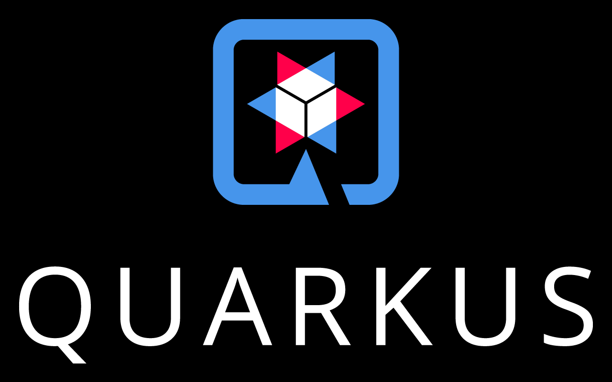

= Technologies
Stevan Vlajic
1.0.0, {docdate}: Plan
//:toc-placement!: // prevents the generation of the doc at this position, so it can be printed afterwards
:sourcedir: ../src/main/java
:icons: font
:sectnums:  // Nummerierung der Überschriften / section numbering
:toc: left

//toc::[]

== Which technologies will be used
* Server: Java (Quarkus)
* Client: HTML, CSS, JS, Frameworks, Libaries
* MySQL -> MariaDB

== Technologies

=== Quarkus

=== HTML, CSS, JS
image::img/front.png[]

=== MYSQL
image::img/sql.png[]
