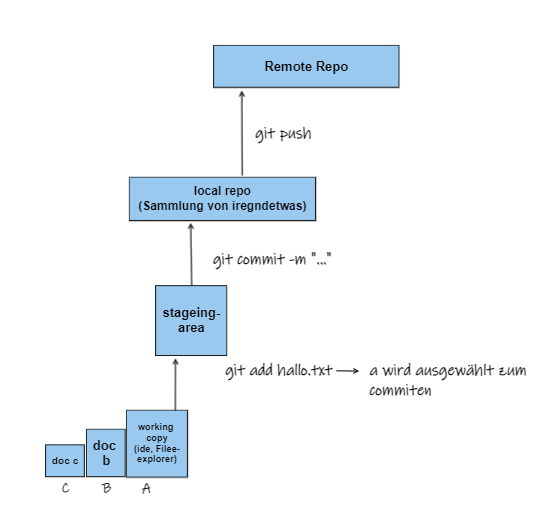

= Git Tutorial
Stevan Vlajic
1.0.0, {docdate}: Plan
//:toc-placement!: // prevents the generation of the doc at this position, so it can be printed afterwards
:sourcedir: ../src/main/java
:icons: font
:sectnums:  // Nummerierung der Überschriften / section numbering
:toc: left

//toc::[]

== Aufbau

== Commands

* **git clone https://github.com/Stevan06v/webstore.git**
Repository von GitHub wird auf eigenen Rechner "geklont".

* *git pull*
** Neuste Änderungen werden von GIT-HUB geholt

* *git add file.adoc*
** Änderungen werden in die Staging Area(Lokal hinzugefügt)
** Commit wird vorbereitet

* *git commit -m "changes done"*
** Änderungen werden in das local repo geschrieben (.git)

* *git push*
** Das Lacal-Repo wird auf den GitHUB-Server geschreieben
** Zu sehen ist das ganze in GitHub selbst unter dem repo: "muster-repo"