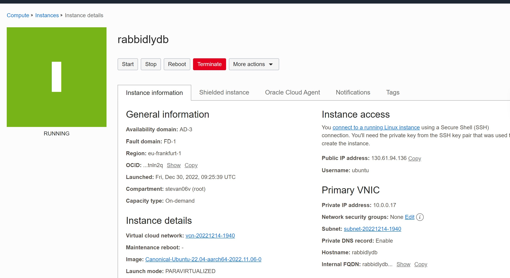
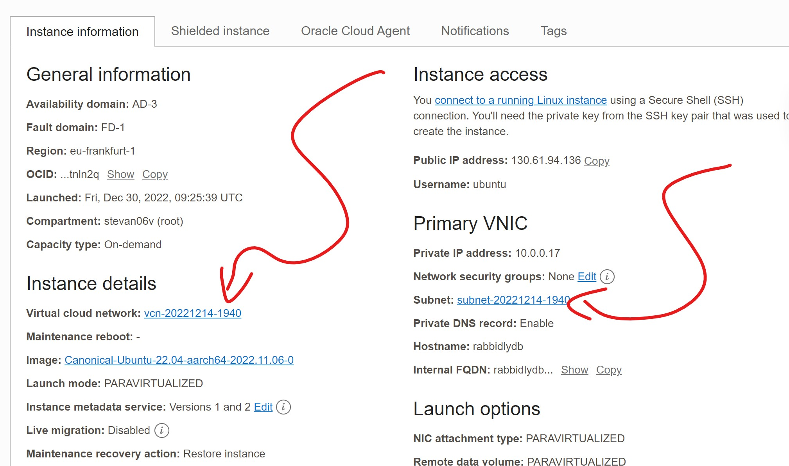
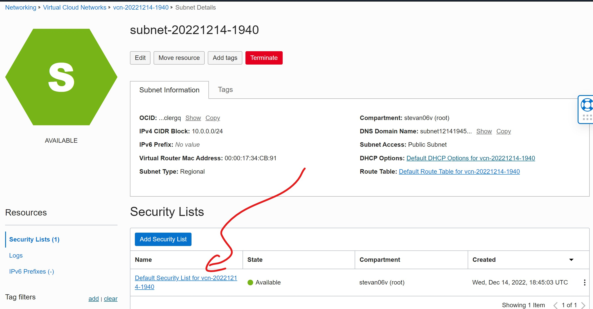
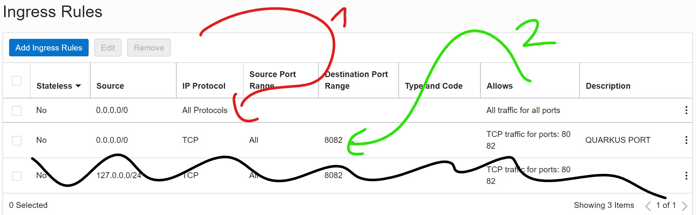

= Backend Setup
Stevan Vlajic
1.0.0, {docdate}: MySQL & Maria-DB
//:toc-placement!: // prevents the generation of the doc at this position, so it can be printed afterwards
:sourcedir: ../src/main/java
:icons: font
:sectnums:  // Nummerierung der Überschriften / section numbering
:toc: left

//toc::[]

== Setup Oracle Cloud-Instance

=== Config-Settings
* 200 GB -Memory
* 16 GB RAM
* Ampere
** 4 Cores
* Ubuntu Linux LATEST

=== KEYS
* Save public key
** Generate PuttyPublic -> Putty-KEYGEN
* Save private key
** generate Private Key -> Putty-KEYGEN

=== PuTTY
* SSH -> AUTH
** Import PuTTY private key
* Connection
** Data -> Username
* Save session
* Connect

=== Shell
* `sudo apt-get update & sudo apt full-upgrade -y`
* logout
* Reboot external

=== Firewall SETUP
* Step 1:

* Step 2:

* Step 3:

** [1]: Enable Every OUTGOING and INCOMING default Port
** [2]: Enable Custom Port [8082] for 0.0.0.0/0
*** 0.0.0.0 Listens and Allows traffic for every IP-address

=== Shell Firewall config
* Disable the default Ubuntu Firewall -> Interrupting the oracle Firewall
** `sudo ufw disable`

* `sudo apt-get update`

==== Basic Firewalld Commands
DOCS at: https://docs.fedoraproject.org/en-US/quick-docs/firewalld/[]

** start firewall
*** `sudo systemctl unmask firewalld`
*** `sudo systemctl start firewalld`

** autostart
*** `sudo systemctl enable firewalld`

** stopping firewall
*** `sudo systemctl stop firewalld`
*** `sudo systemctl disable firewalld`

** Check firewalld status of the status
*** `sudo firewall-cmd --state`

** Check firewall status
*** `sudo systemctl status firewalld`

** List all open ports
*** `firewall-cmd --list-all`

== Setup firewalld (my case)
** `sudo apt install firewalld`
** `sudo systemctl enable firewalld`
** `sudo firewall-cmd --permanent --zone=public --add-port=80/tcp`
** `sudo firewall-cmd --permanent --zone=public --add-port=443/tcp`
** `sudo firewall-cmd --reload`

== Application Port
Open the application for every IP-address

* Quarkus
** src -> main -> resources -> application.properties
*** `quarkus.http.host=0.0.0.0`
*** `quarkus.http.port=8082`

== Finished
* http://xxx.xxx.xxx:8082