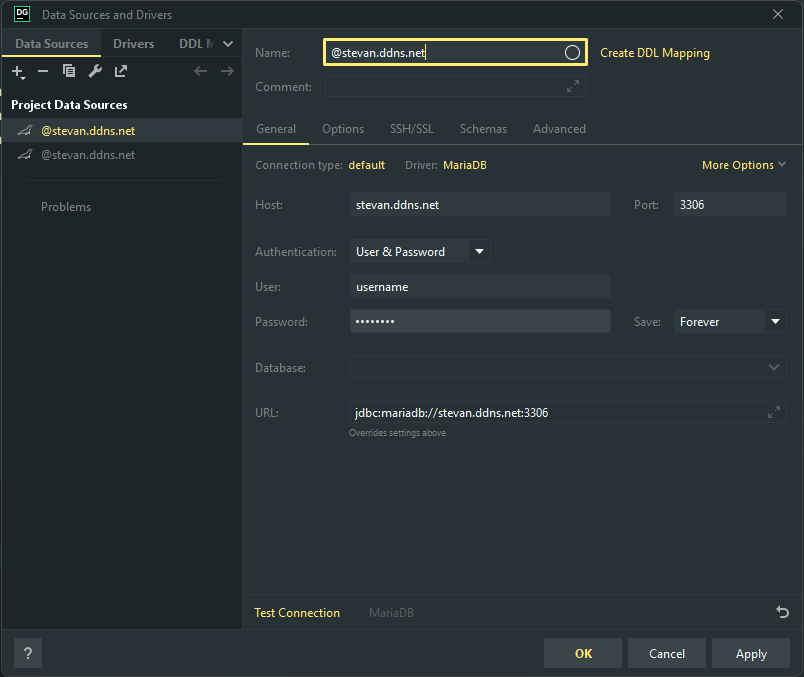
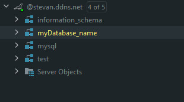
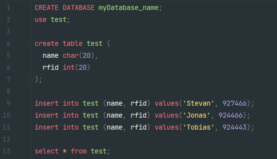

= Maria-DB & MySQL
Stevan Vlajic
1.0.0, {docdate}: MySQL & Maria-DB
//:toc-placement!: // prevents the generation of the doc at this position, so it can be printed afterwards
:sourcedir: ../src/main/java
:icons: font
:sectnums:  // Nummerierung der Überschriften / section numbering
:toc: left

//toc::[]

== How to install
`sudo apt install mariadb-server`

`sudo mysql_secure_installation`

`-y,-y,-y,-y...`

== Open Maria-DB-PORT
* `sudo iptables -I INPUT -p tcp -m tcp --dport 3306 -j ACCEPT`

== How to configure
=== Make it accessable from everywhere
`sudo nano /etc/mysql/mariadb.conf.d/50-server.cnf`

* *Methode One:*
** `bind-adress         = 0.0.0.0`

* *Methode Two:*
** `bind-adress         = stevan.ddns.net`

=== Restart MYSQL-database
`sudo service mysql restart`

== Basic MySQL statements for configuration
=== Enter MariaDB-Monitor
`sudo mysql`

=== Delete MYSQL and MariaDB
`sudo apt-get remove --purge mysql\*`

`sudo apt-get remove --purge mariadb\*`

=== Exit MariaDB-Monitor
`exit`

=== Create user
`CREATE USER 'username'@'%' IDENTIFIED BY 'password';`

=== Create user if not exists
`CREATE USER IF NOT EXISTS 'user'@'%' IDENTIFIED BY 'password';`

`CREATE USER IF NOT EXISTS 'user'@'localhost' IDENTIFIED BY 'password';`

=== User grants
`GRANT ALL PRIVILEGES ON * . * TO 'username'@'%' WITH GRANT OPTION;`

`GRANT ALL PRIVILEGES ON * . * TO 'username'@'localhost' WITH GRANT OPTION;`

=== Delete user
`DROP USER 'username'@'%';`

`DROP USER 'username'@'localhost';`

== Connect Maria-DB to Data-Grip
=== Select Maria-DB
=== Configure

== Database commands in Data-Grip

=== Create database
`CREATE DATABASE myDatabase_name;`

=== Drop database
`DROP DATABASE myDatabase_name;`

=== SELECT database to use it
`use myDatabase_name;`

== Insight View: Code Snippet
