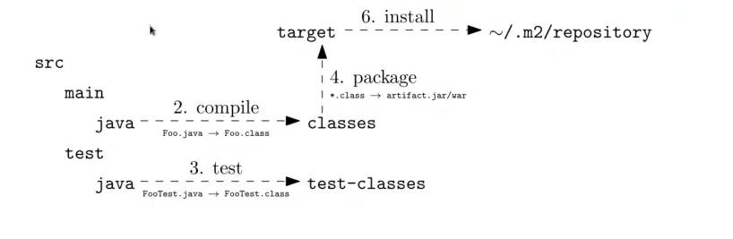
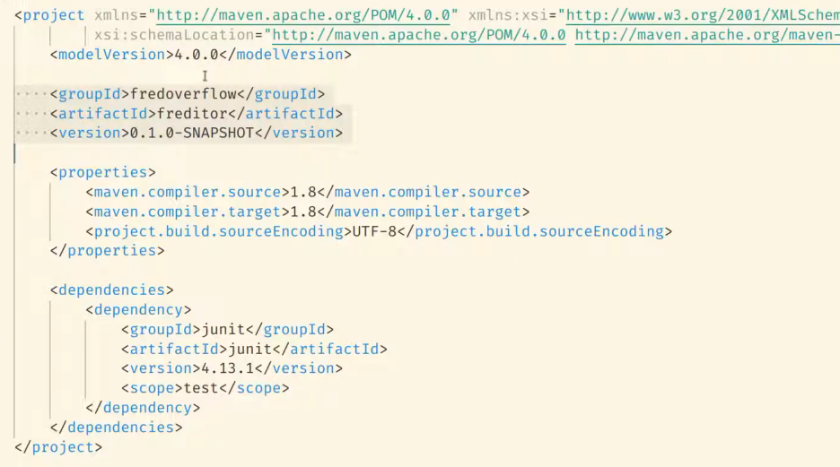

= Java in genral (Maven, JARS, Compiler etc)
Stevan Vlajic
1.0.0, {docdate}: MySQL & Maria-DB
//:toc-placement!: // prevents the generation of the doc at this position, so it can be printed afterwards
:sourcedir: ../src/main/java
:icons: font
:sectnums:  // Nummerierung der Überschriften / section numbering
:toc: left

//toc::[]

// https://www.youtube.com/watch?v=ExKq23bNABk

== What happens in the background
image::./img/Bytecode.png[]

== Java Compiler
** `javac ./src/Helloworld.java`

* Purpose of the Java-Compiler
** The compiler translates the written java code to java byte code.
** The java byte code is stored in the created `Helloweorld.class` file.
** The JVM (Java-Virtual-Machine) transaltes the java byte code to machine code

== JAR-Files

=== What is JAR
A JAR (Java Archive -> internal zip) is a package file format typically used to aggregate
many Java class files and associated metadata and resources (text, images,
etc.) into one file to distribute application software or libraries on the

=== Usecase
* Deploy server

=== How to create a JAR file
cvf: Create verbose file:
`java cvf app.jar *.class`

=== Inspect JAR-File
Like ls -a in linux...

`jar tvf app.jar`

=== How to create runnable JAR-File
Create verbose manifest file:

* `jar cvfm app.jar manifest.txt *.class`

* A manifest is a file which defines where the main class is located

=== Run JAR-File
`java -jar app.java`

== Maven

=== Problems solved with Maven
* Dependency Management
** No plugins or libraries are needed -> automatic download
*** You don't have to go to the browser and downlaod the required libraries yourself

* Reduces BUILD
** A Build is A excecuteable JAR File

=== How to recognise Maven-Project
Maven projects always have a `POM.xml`

=== Mavens directory structure
* src
** main
*** java
**** helloworld.java
** test
*** java -> JUNIT

* target
** classes
** test-classes

=== POM XML

==== Structure
** First three lines are copied out of other projects

*** <groupId>
**** GitHub Name
*** <arctfactId>
**** app name
*** <version>
**** artifact will be developed semantic versioning

** <properties>
*** <first>: java version
*** <second>: java compiler version
*** <thrid>: UTF-8

** <dependencies>

You define what maven has to download automatically, because the project depends on some libraries

=== Maven standard live-cyclus

The unmarked phases do defaultly nothing. Maven plugins can be added to this phases.
The marked phases have defaulty installed meaningful plugins.

* validate
* *compile* (compiles src/main/java to target/classes)
* *test* (compiles src/test/java to taregt/test-classes)
* *package* (wraps target/classes into a .jar-file)
* verify
** for exmaple: Sonacube-Plugin for checking code quality
* *install* copies .jar as local dependency to ~/.m2/repository
* deploy (deploy into an maven)

If one of the phases fail, other phases can not run.
If one a test fails -> logical error -> other phases wont  run.

=== How maven works
If you run the follwoing:

* `$ mvn install`
** `mvn validate`
** `mvn compile`
** `mvn test`
** `mvn verify`
** `mvn install`

mvn install will be compiles after its pre-phases.

=== Maven Commands

==== Maven Compiler Plugin
`mvn compile`

* The comamnd will validate and compile the code.
* First time run -> plugins will be installed
* A target directory will be created

==== Maven test
`mvn mvn test`

Downloads the Plugins for the test-phase.

* maven test runs the
** validate-phase
** compile-phase
*** trying to compile
** test-phase
*** test are started

=== Maven repository
Mave stores the installes artefacts(libraries) into its created repository.

* Adding own libraries
** Maven get its dependencies defaultly from https://mvnrepository.com/
** Your libraries should be stores into the `~/.m2/repository` to use them

* Directory
** `~/.m2/repository`

=== Installation 

==== JDK

* `sudo apt update && sudo apt upgrade -y`
* `sudo add-apt-repository ppa:linuxuprising/java -y`
* `sudo apt update`
* `sudo apt-get install oracle-java17-installer oracle-java17-set-default`

* `java -version`

==== MAVEN

===== Download the Maven Binaries

`$ wget https://mirrors.estointernet.in/apache/maven/maven-3/3.6.3/binaries/apache-maven-3.6.3-bin.tar.gz`

`$ tar -xvf apache-maven-3.6.3-bin.tar.gz`

`$ mv apache-maven-3.6.3 /opt/`

===== Setting M2_HOME and Path Variables

`nano .bashrc`

`M2_HOME='/opt/apache-maven-3.6.3'`
`PATH="$M2_HOME/bin:$PATH"`
`export PATH`

===== Verify the Maven installation
`$ mvn -version`